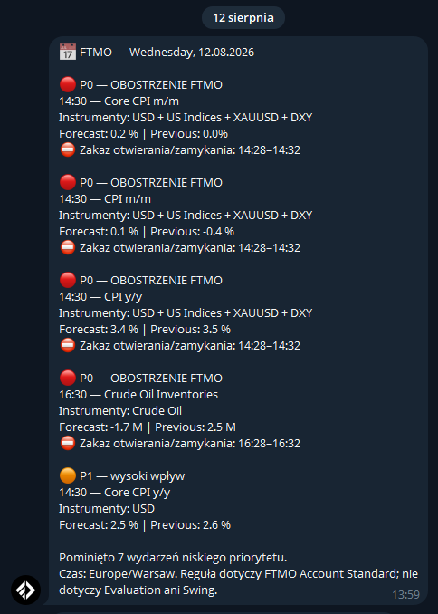

# FTMO Calendar Telegram Notifier

Lekka usługa w Pythonie, która pobiera kalendarz ekonomiczny FTMO i wysyła na Telegram:

- codzienne podsumowanie wydarzeń P0/P1/P2,
- specjalne przypomnienie każdego 13. dnia miesiąca: `Dziś 13! Nie graj niczego 🙂`,
- przypomnienia 15 i 5 minut przed wydarzeniami z obostrzeniami FTMO,
- wynik `actual` oraz godzinę zakończenia obostrzenia po publikacji.

Domyślnie bot uwzględnia wyłącznie wydarzenia od poniedziałku do piątku,
w godzinach 07:00–20:00 czasu ustawionego w `TIMEZONE` (obie granice włącznie).
W weekend nie wysyła podsumowania, przypomnień ani komunikatu na 13. dzień miesiąca.

## Podgląd powiadomienia

Tak wygląda przykładowe dzienne podsumowanie w aplikacji Telegram:

<p align="center">
  
</p>

Usługa korzysta z publicznego endpointu JSON używanego przez stronę kalendarza FTMO. Nie wymaga Selenium, Playwrighta ani uruchamiania przeglądarki.

## Priorytety

| Priorytet | Znaczenie |
| --- | --- |
| P0 | wydarzenie z `restriction=true` |
| P1 | high impact |
| P2 | medium impact |
| P3 | low impact |
| P4 | holiday lub nieznany typ |

Obostrzenie P0 dotyczy FTMO Account Standard. Według zasad FTMO nie dotyczy Evaluation Process ani FTMO Account Swing. Zawsze sprawdź aktualne warunki swojego konta na stronie FTMO.

## Wymagania

- Linux z systemd, np. Debian 12 lub Ubuntu 22.04/24.04,
- Python 3.11 lub nowszy,
- `git`, `python3-venv` i dostęp HTTPS do FTMO oraz Telegrama,
- bot Telegram utworzony przez `@BotFather`,
- identyfikator czatu Telegram.

## 1. Przygotowanie bota Telegram

1. W Telegramie otwórz rozmowę z `@BotFather`.
2. Wykonaj `/newbot` i zachowaj otrzymany token.
3. Napisz dowolną wiadomość do nowego bota.
4. Odczytaj `chat_id`, np. otwierając:

   ```text
   https://api.telegram.org/bot<TOKEN>/getUpdates
   ```

Token traktuj jak hasło. Nie zapisuj go w repozytorium ani w historii poleceń dostępnej dla innych użytkowników.

## 2. Instalacja na Linuxie

Poniższe polecenia wykonaj z konta posiadającego `sudo`:

```bash
sudo apt update
sudo apt install -y git python3 python3-venv

sudo useradd --system \
  --home-dir /var/lib/ftmo-calendar-notifier \
  --create-home \
  --shell /usr/sbin/nologin \
  ftmo-notifier

sudo git clone https://github.com/MrRexo/ftmo-calendar-telegram-notifier.git \
  /opt/ftmo-calendar-telegram-notifier

sudo python3 -m venv /opt/ftmo-calendar-telegram-notifier/.venv
sudo /opt/ftmo-calendar-telegram-notifier/.venv/bin/pip install \
  -r /opt/ftmo-calendar-telegram-notifier/requirements.txt

sudo install -d -m 0750 -o ftmo-notifier -g ftmo-notifier \
  /var/lib/ftmo-calendar-notifier
```

## 3. Konfiguracja

Utwórz plik konfiguracyjny poza katalogiem repozytorium:

```bash
sudo install -m 0600 -o root -g root /dev/null \
  /etc/ftmo-calendar-notifier.env
sudo nano /etc/ftmo-calendar-notifier.env
```

Minimalna konfiguracja:

```dotenv
TELEGRAM_BOT_TOKEN=wklej_token_z_BotFather
TELEGRAM_CHAT_ID=wklej_chat_id
TIMEZONE=Europe/Warsaw
SUMMARY_TIME=07:00
EVENT_TIME_FROM=07:00
EVENT_TIME_TO=20:00
EXCLUDE_WEEKENDS=true
POLL_SECONDS=300
REMINDER_MINUTES=15,5
SUMMARY_IMPACTS=high,medium
SEND_SUMMARY_ON_START=true
SUMMARY_GRACE_MINUTES=180
STATE_FILE=/var/lib/ftmo-calendar-notifier/state.json
SNAPSHOT_FILE=/var/lib/ftmo-calendar-notifier/latest.json
REQUEST_TIMEOUT_SECONDS=20
```

`SEND_SUMMARY_ON_START=true` powoduje wysłanie jednego zestawienia zaraz po pierwszym uruchomieniu. Deduplikacja w `state.json` zapobiega ponownemu wysłaniu tego samego podsumowania po restarcie.

`EVENT_TIME_FROM` i `EVENT_TIME_TO` określają dozwolone godziny wydarzeń w lokalnej
strefie `TIMEZONE`. `EXCLUDE_WEEKENDS=true` wyłącza soboty i niedziele.

## 4. Uruchomienie jako usługa systemd

```bash
sudo install -m 0644 \
  /opt/ftmo-calendar-telegram-notifier/deploy/ftmo-calendar-bot.service \
  /etc/systemd/system/ftmo-calendar-bot.service

sudo systemctl daemon-reload
sudo systemctl enable --now ftmo-calendar-bot.service
```

Sprawdzenie działania:

```bash
systemctl status ftmo-calendar-bot.service --no-pager
sudo journalctl -u ftmo-calendar-bot.service -n 50 --no-pager
```

Po poprawnym uruchomieniu w logu pojawi się `Daily summary sent`, a na wskazanym czacie Telegram zostanie wysłane pierwsze zestawienie.

## Aktualizacja

```bash
sudo git -C /opt/ftmo-calendar-telegram-notifier pull --ff-only
sudo /opt/ftmo-calendar-telegram-notifier/.venv/bin/pip install \
  -r /opt/ftmo-calendar-telegram-notifier/requirements.txt
sudo systemctl restart ftmo-calendar-bot.service
sudo systemctl status ftmo-calendar-bot.service --no-pager
```

## Testy

Testy nie korzystają z prawdziwego tokenu Telegram:

```bash
cd /opt/ftmo-calendar-telegram-notifier
.venv/bin/python -m unittest discover -s tests -v
```

## Bezpieczeństwo i dane

- prawdziwy token i `chat_id` nie są częścią repozytorium,
- `.env`, `env.txt`, snapshoty API, stan powiadomień i pliki Pythona są ignorowane przez Git,
- jednostka systemd działa jako osobny użytkownik bez możliwości logowania,
- `NoNewPrivileges`, `ProtectSystem`, `ProtectHome` i `PrivateTmp` ograniczają usługę,
- plik `/etc/ftmo-calendar-notifier.env` powinien mieć uprawnienia `0600`.

## Ważna informacja

Projekt nie jest powiązany z FTMO ani Telegramem. Endpoint kalendarza nie jest udokumentowanym publicznym API dla integratorów i może zostać zmieniony. Powiadomienia są pomocą operacyjną, a nie gwarancją zgodności z regulaminem — przed handlem sprawdź aktualny kalendarz i zasady FTMO.
